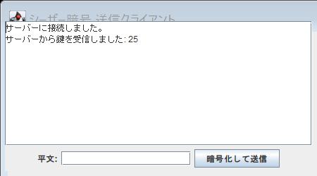
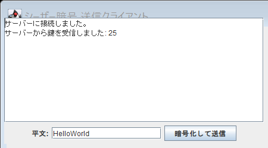
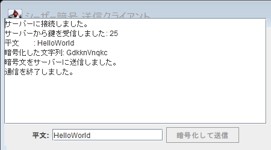
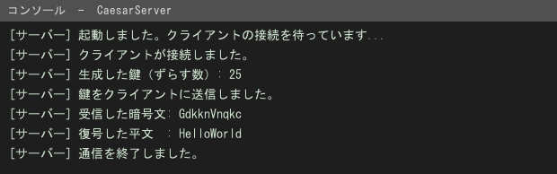

# Caesar Cipher over TCP Socket (Java / Swing)

Java の TCP ソケット通信と Swing GUI を使い、**サーバが生成した鍵をクライアントへ配送し、その鍵でシーザー暗号化した文字列を送受信する**クライアント／サーバアプリケーションです。金沢工業大学「オブジェクト指向プログラミング」レポート課題として作成しました。

作成者: 昆野 和也（Kazuya Konno） / 金沢工業大学 情報理工学部 情報工学科

---

## 概要

| 項目 | 内容 |
|---|---|
| 言語 | Java (Java SE 17 で動作確認) |
| GUI | Swing (`JFrame` / `JTextArea` / `JTextField` / `JButton`) |
| 通信 | `ServerSocket` / `Socket`（TCP, `127.0.0.1:5000`） |
| 乱数 | `java.security.SecureRandom` |
| 暗号 | シーザー暗号（A–Z / a–z のみシフト、それ以外は素通し） |

## 動作の流れ

```
[CaesarServer]                          [CaesarClient]
  ServerSocket(5000) で待ち受け
        │
        │  ← TCP 接続 ─────────────────  Socket("127.0.0.1", 5000)
        │
  SecureRandom で鍵 k (1..25) を生成
        │  ── 鍵 k を送信 ────────────→   鍵を受信して保持
        │
        │                                 平文を鍵 k でシフト（暗号化）
        │  ← 暗号文を受信 ─────────────  暗号文を送信
        │
  同じ鍵 k で復号し、標準出力に表示
  接続をクローズ
```

- **鍵の生成をサーバ側に集約**することで、クライアントは鍵を自分で決めない設計にしています。
- 鍵の生成には `Random` ではなく `SecureRandom` を使用しています。
- 暗号化 / 復号は同じシフト量の加減算で対称になるよう実装し、`(c - 'a' - key + 26) % 26` として負のインデックスを避けています。

## ファイル構成

| ファイル | 役割 |
|---|---|
| `CaesarServer.java` | サーバ。鍵の生成・送信、暗号文の受信、復号、結果表示 |
| `CaesarClient.java` | クライアント。Swing GUI、鍵の受信、暗号化、暗号文の送信 |
| `Main.java` | ファイル入出力課題。ソースを1行ずつ読み、行番号と波括弧の有無を示す記号を付けてファイルへ出力する |
| `Client_output.txt` / `Server_output.txt` | `Main.java` が生成した出力例 |
| `screenshots/` | 実行画面のキャプチャ |

`Main.java` は、各行に `+`（`{` を含む）／`-`（`}` を含む）／`*`（両方を含む）を付与し、`%04d` で行番号を整形して出力します。`BufferedReader` / `BufferedWriter` と `String.format` の練習を兼ねた課題です。

## 実行方法

```bash
javac -encoding UTF-8 CaesarServer.java CaesarClient.java Main.java

# ターミナル1（先に起動する）
java CaesarServer

# ターミナル2
java CaesarClient
```

クライアントのウィンドウに平文を入力し「暗号化して送信」を押すと、サーバ側のコンソールに受信した暗号文と復号結果が表示されます。1回の送信で接続を閉じる仕様です。

`Main.java` は `CaesarClient.java` と同じディレクトリで `java Main` を実行してください。

## スクリーンショット

| 送信前 | 入力 | 送信後 |
|---|---|---|
|  |  |  |

サーバ側コンソール:



## 補足・既知の制限

学習用の課題プログラムであり、実運用を意図したものではありません。

- シーザー暗号自体に暗号強度はありません（総当たり25通りで解読可能）。
- 鍵を暗号化せずそのまま平文で送っているため、通信路を傍受されれば鍵が漏れます。鍵配送の問題を解決するハイブリッド暗号方式については、別リポジトリ [hybrid-crypto-login-demo](../../hybrid-crypto-login-demo) で扱っています。
- 例外処理は課題の範囲に留めており、再接続や複数クライアントの同時接続には対応していません。

## ライセンス

MIT License
